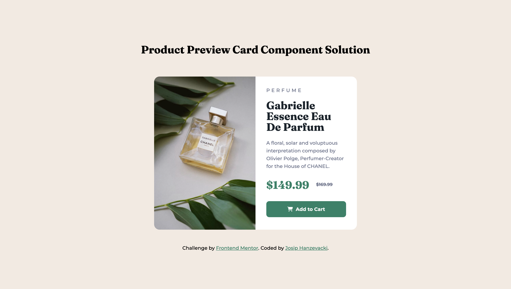

# Frontend Mentor - Product Preview Card Component Solution

This is a solution to the [Product preview card component challenge on Frontend Mentor](https://www.frontendmentor.io/challenges/product-preview-card-component-GO7UmttRfa).

## Table of Contents

- [Overview](#overview)
    - [The Challenge](#the-challenge)
    - [Screenshot](#screenshot)
    - [Links](#links)
- [My Process](#my-process)
    - [Built With](#built-with)
    - [What I Learned](#what-i-learned)
    - [Continued Development](#continued-development)
    - [Useful Resources](#useful-resources)
- [Author](#author)
- [Acknowledgments](#acknowledgments)

## Overview

### The Challenge

Users should be able to:

- View the optimal layout depending on their device's screen size.
- See hover and focus states for interactive elements.

### Screenshot

### Links

- Solution URL: [GitHub](https://github.com/josip-h/product-preview-card-component)
- Live Site URL: [GitHub Pages](https://josip-h.github.io/product-preview-card-component/)

## My Process

### Built With

- Semantic HTML5 markup
- CSS
- Flexbox
- Mobile-first workflow

### What I Learned

While studying responsive layout materials, I learned several techniques for building more responsive and accessible projects. Due to the extensive course material, I decided to practice by building this project, focusing on:

1. **Relative Units (rem, em)**
    - By working through Kevin Powell's [free course](https://courses.kevinpowell.co/view/courses/conquering-responsive-layouts/) on responsive design, particularly his [video](https://www.youtube.com/watch?v=_-aDOAMmDHI&ab_channel=KevinPowell) on the use of relative units, I learned how to create code that proportionally scales rendered components, ensuring consistent appearance regardless of the root element's font size.

2. **Logical Properties**
    - Another excellent resource for responsive design is the [web.dev](https://web.dev) website. Their [responsive design materials](https://web.dev/learn/design) introduced me to [logical properties](https://developer.mozilla.org/en-US/docs/Web/CSS/CSS_logical_properties_and_values/Basic_concepts_of_logical_properties_and_values), which ensure content displays correctly in different languages based on the direction of the writing/reading system.

### Continued Development

As I continue to go through the remaining course materials, I plan to redo or update my projects with more optimal code. Specifically, I aim to become more proficient with media queries, improving my ability to decide when and how to implement them and selecting appropriate breakpoints.

### Useful Resources

- [Frontend Mentor Building Responsive Layouts Course](https://www.frontendmentor.io/learning-paths/building-responsive-layouts--z1qCXVqkD)
- [web.dev](https://web.dev)
- [Kevin Powell's Free Course on Responsive Layouts](https://courses.kevinpowell.co/view/courses/conquering-responsive-layouts)

## Author

- GitHub: [Josip Hanzevacki](https://github.com/josip-h)
- Frontend Mentor: [@josip-h](https://www.frontendmentor.io/profile/josip-h)

## Acknowledgments

I would like to thank all the people who created and made available the resources listed in this file.